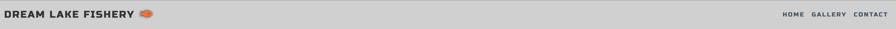
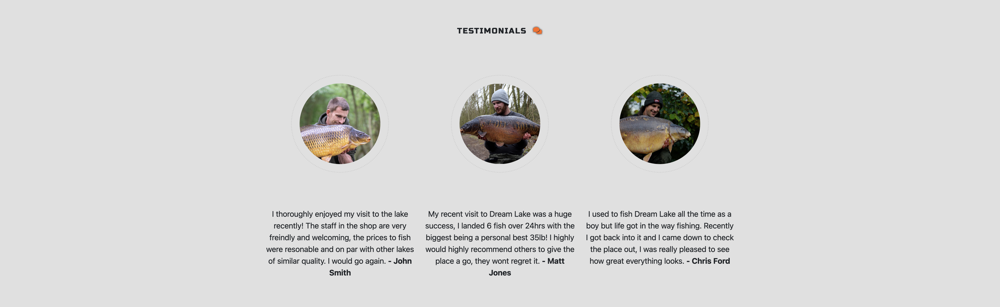
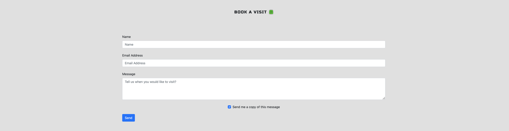
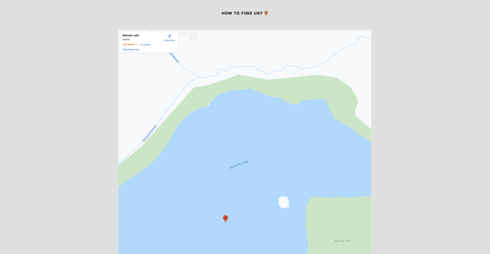

# Dream Lake Fishery

Dream Lake Fishery is a site that caters to Specifically to Carp Anglers by advertising Dream Lake, a fishery in Surrey, England. The site will be targeted toward anglers who are looking to fish a big lake stocked with big Carp. Dream Lake Fishery will be useful for Carp anglers to find out more information about Dream Lake, browse memorable captures in the gallery and have the ability to conveniently book sessions online.

## User Experience (UX)

### User stories

-   First Time Visitor Goals

    -   As a First Time Visitor, I want to easily understand the main purpose of the site and learn more about what services are available.
    -   As a First Time Visitor, I want to be able to easily navigate throughout without issues and explore the content.
    -   As a First Time Visitor, I want to look for location information so I know how far the venue is from my house.

-   Returning Visitor Goals

    -   As a Returning Visitor, I want to find recent catch reports.
    -   As a Returning Visitor, I want to find the best way to get in contact with the fishery with any photo submission questions or complaints I may have.
    -   As a Returning Visitor, I want to find community links.

-   Frequent User Goals
    -   As a Frequent User, I want to check to see if there are any newly added gallery photos of unique recent captures.
    -   As a Frequent User, I want to check to see if there is any news regarding fish stocks and pricing changes.
    -   As a Frequent User, I want to check if there are lake closures for any reason (bad weather etc)

### Design

-   Colour Scheme

    -   The two main colours I used are shades of light grey. They were used for the background, navbar and footer. Other accent colours include red, blue and green for the logo and icons.

-   Typography

    -   The Russo One font is the main font used throughout the whole website with Sans Serif as the fallback font if for any reason the font isn't being imported into the site correctly. Russo One is a strong font that is easy to read and fits the theme well.

-   Imagery
    -   Imagery is important. The large, hero image is designed to be bold and catch the user's attention. It has a calming sense of openness and freedom, with a pleasing symmetry.
    -   The images in the gallery are exactly what the user of this site wants to see, in-sync with each other and provide information to the viewer.

### Wireframes

-   Home Page Wireframes - [View](assets/wireframes/homepage-desktop.png) [View](assets/wireframes/homepage-tablet.png) [View](assets/wireframes/homepage-mobile.png)

-   Gallery Wireframes - [View](assets/wireframes/gallery-desktop.png) [View](assets/wireframes/gallery-tablet.png) [View](assets/wireframes/gallery-mobile.png)

-   Contact Page Wireframes - [View](assets/wireframes/contact-desktop.png) [View](assets/wireframes/contact-tablet.png) [View](assets/wireframes/contact-mobile.png)

## Features

-   Navigation Bar\_\_
    -   Featured on all three pages, the fully responsive navigation bar includes links to the Logo, Home page, Gallery and Contact page which is identical on each page to allow for easy navigation.
    -   This section will allow the user to easily navigate from page to page across all devices without having to revert back to the previous page via the ‘back’ button.

-   The landing page image\_\_
    -   The landing includes a striking photograph to allow the user to see exactly what the website is about.
    -   This section introduces the user to Dream Lake Fishery with a wide angle view of the lake itself from the jetty.

-   Welcome to Dream Lake Fishery Section
    -   The welcome to Dream Lake Fishery section will allow the user to understand more about the topography of the lake, the overall size of the lake, the different species of fish present and the total amount of swims available for anglers to book.
    -   The user will see the value of fishing this lake due to the stocking of large Carp. This should encourage the user to consider booking a session at Dream Lake Fishery.

  

-   Testimonials Section
    -   This section will allow the user to see testimonials from previous anglers who have already fished at Dream Lake Fishery.
    -   The testimonials section is valuable to the user because it allows them to see that Dream Lake Fishery is safe and run by professionals who are friendly and helpful.

  

-   The Footer
    -   The footer section includes links to the relevant social media sites for Dream Lake Fishery. The links will open to a new tab to allow easy navigation for the user.
    -   The footer is valuable to the user as it encourages them to keep connected via social media.

  

-   Gallery
    -   The gallery will provide the user with supporting images to see some of the biggest captures from Dream Lake.
    -   This section is valuable to the user as they will be able to easily identify the varying sizes of fish the lake stocks.

  

-   The Contact section
    -   This section will allow the user to book fishing sessions at Dream Lake Fishery. The user will be able specify when they would like to fish and for how long, the user will also be asked to submit their full name and email address.
    -   This section is valuable because it allows the user to plan their sessions in advance and be sure that there will be available swims for their visit.

  

-   How To Find Us section
    -   This section will allow the user to find Dream Lake Fishery. The user will be able to click on the google map and be linked externally to the google maps app or the google maps website for easy navigation.
    -   This section also allows the user to see a 7 day weather forecast.
    -   This section allows users to interact with the map and see locations of previously caught fish.
    -   This section is valuable because it allows the user find Dream Lake Fishery.

  

## Features Left to Implement

-   Another feature idea would be to have a page called 'Catch Reports' where anglers can upload their own captures to be featured on the site, this would give new anglers of Dream Lake Fishery the ability to see how well the lake is currently fishing on a daily basis.
- Labels on the individual fish describing name, weight, last date caught.
- On click images on each individual fish showing the actual fish photo with angler.

## Technologies Used

Languages Used

-   HTML5
-   CSS3
-   JS

## Frameworks, Libraries & Programs Used

-   Bootstrap 5:
    -   Bootstrap was used to assist with the responsiveness and styling of the website.
-   Google Fonts:
    -   Google fonts were used to import the "Russo" font via a link in the head of index.html.
-   Font Awesome:
    -   Font Awesome was used on all pages throughout the website to add icons for aesthetic and UX purposes.
-   Ionicons:
    -   Ionicons were used for the droplet icon on the index.html page.
-   jQuery:
-   jQuery came with Bootstrap to make the navbar responsive.
-   Git
-   Git was used for version control by utilising the Gitpod terminal to commit to Git and Push to GitHub.
-   GitHub:
-   GitHub is used to store the projects code after being pushed from Git.
-   Balsamiq:
-   Balsamiq was used to create the wireframes during the design process.
-   Google Map API is used for the embedded map.
-   Email.js was used for the contact form.
-   Weatherwidget.io API was used for the weather widget.

## Validation Testing

The W3C Markup Validator and W3C CSS Validator Services were used to validate every page of the project to ensure there were no syntax errors in the project.

-   W3C Markup Validator - [View](assets/validator/html-validator.png)
-   W3C CSS Validator - [View](assets/validator/css-validator.png)

## Testing User Stories from User Experience (UX) Section

* First Time Visitor Goals
  * As a First Time Visitor, I want to easily understand the main purpose of the site and learn more about the organisation.
    * Upon entering the site, users are automatically greeted with a clean and easily readable navigation bar to go to the page of their choice. Underneath there is a Hero Image followed by a large welcome heading which scrolls on to inform the user the purpose of the site.
    * The main points are made immediately within the welcome section.
    * The user has three options: The gallery page to view memorable captures, the contact us page to fill out the contact form or the google maps link to show our full address and exact location.

  * As a First Time Visitor, I want to be able to easily be able to navigate throughout the site to find content.
    * The site has been designed to be fluid and never to entrap the user. At the top of each page there is a clean navigation bar, each link describes what the page they will end up at clearly.
    * On the Contact Us Page, after a form response is submitted, the page refreshes and the user is brought to the top of the page where the navigation bar is.

  * As a First Time Visitor, I want to look for testimonials so I know if the species of fish in the lake match my criteria and to know how it is fishing.
    * Once the new visitor has scrolled past the image they will immediately be provided the welcome section.

* Returning Visitor Goals
  * As a Returning Visitor, I want to find information about the most recent captures.
    * These are clearly shown on the gallery.

  * As a Returning Visitor, I want to find the best way to get in contact with the Fishery with any questions I may have.
    * The navigation bar clearly highlights the "Contact Us" Page.
    * Here they can fill out the form on the page to be contacted, or they can use the Daycare contact details.
    * The footer contains links to the organisations Facebook, Twitter and Instagram page.
    * Whichever link they click, it will be open up in a new tab to ensure the user can easily get back to the website.

  * As a Returning Visitor, I want to find community links.
    * The Facebook Page can be found at the footer of every page and will open a new tab for the user and more information can be found on the Facebook page.

* Frequent User Goals
  * As a Frequent User, I want to check to see if there are any newly added photos in the Gallery..
    * The user would already be comfortable with the website layout and can easily access the Gallery pages.
    * As a Frequent User, I want to check to see if there are any new impressive catches..
            The user would already be comfortable with the website layout and can easily see if any new catches have been added.
    * As a Frequent User, I want to check if there are lake closures for any reason (bad weather etc).
    * The homepage will provide a big, red banner saying "lake closed" so the user would quickly be able to check if there have been any changes.

### Further Testing

-   The Website was tested on Google Chrome, Internet Explorer, Firefox and Safari browsers.
-   The website was viewed on a variety of devices such as Desktop, Laptop, iPhone 11 & iPhone 11proMAX.
-   A large amount of testing was done to ensure that all pages were linking correctly.

## Known Bugs

 * When sized down to a mobile view, the bootstrap gallery sections into 2 photos per column which gives the appearance of uneven white spacing between the photos.
 * Dream Lake Fishery marker label overlaps the marker svg icon and the Mercers Lake label.
 * Console errors, google not defined among others.

## Credits

### Code

-   The Hero Image animation came from Code Institute, Love Running Project.

-   Bootstrap5: Bootstrap Library used throughout the project mainly to make site responsive using the Bootstrap Grid System.

-   Google maps API code and base templates taken from Google API get started page.

### Content

-   All content was written by the developer.

### Media

-   Some images were sourced from www.pexels.com - <https://www.pexels.com/>

    -   "background-image" - Thirdman
    -   "hero-mobile-image" - Thirdman
    -   "gallery-image-1" - Thirdman

-   Some images were sourced from www.unsplash.com - <https://www.unsplash.com/>

    -   "hero-image" - Aaron Burden

-   Some images were sourced from google images - <https://www.images.google.com/>

    -   "gallery-image-2" - <https://www.fishermanholidays.com/nl/goncourt-3-bekende-nieuwe-meren-bij-fisherman-holidays>
    -   "gallery-image-3" - <https://twitter.com/carlandalex/status/1014202511614410752>
    -   "gallery-image-4" - <https://twitter.com/carlandalex/status/1252161259044327425>
    -   "gallery-image-5" - <https://www.carpology.net/article/features/paradise-lost/>
    -   "gallery-image-6" - <https://www.mainline-baits.com/mainline-articles/fishing-large-lakes--222/>
    -   "profile-image-1" - <https://www.carpsocial.com/wp-content/uploads/2020/03/for-richard-scaled.jpg>

-   One image was sourced from freesvg.org - <https://freesvg.org/dibujo-9>

-   Some images I was unable to source

    -   "profile-image-2" - No Source
    -   "profile-image-3" - No Source
